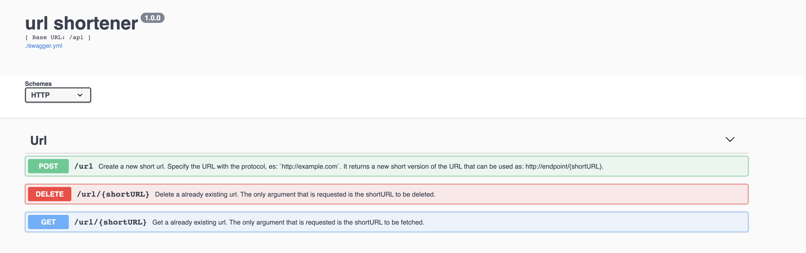

URL shortener
-
This is an example of how to create a URL shortener using:

 - go-swagger as api Framework (OpenAPI 2.0)
 - swagger-ui as frontend to publish documentation and provide a way to test APIs
 - The apis logic need storage, that is passed as an `interface` to make easier change it

    - "github.com/boltdb/bolt" has been chosen as implementation since it is a quick key-value db
 - prometheus is used to expose metrics under /metrics.
 - dependencies are managed through `go mod`
 - redirection is performed before hitting the API in the middleware
 - error management is present but covers only most common cases
 
The code **NOT** autogenerated is included in the following packages/files:
   
   - `storage` package (logic of storage)
   - `middlewares` package (logic to redirect, prometheus)
   - `url_implementation` package (logic of APIs)
   - `restapi/operation/configure_url_shortener.go` file (linking pieces)
   - `swagger-ui/swagger.yml` file (open-api definition, used to auto-generate the code)

The code autogenerated is NOT covered by tests, everything else has a coverage of ~ 80%

Development:
-

To add new Api modify `swagger-ui/swagger.yml` and run:
 
 `$swagger generate server  -f ./swagger-ui/swagger.yml --exclude-main`

Be aware, if you modify any autogenerated file it will be overwritten running such command.

Run test running:
  `$go test ./...`

Usage
-
To execute the server clone the repo, cd into it and run:

`$go run ./cmd/url-shortener-server/main.go --port 35307`

Navigate to `localhost:35307/swagger-ui` to visualise the UI and test APIs with a frontend
Navigate to `localhost:35307/metrics` to check metrics, in particular `url_redirected` keeps track of redirection since last execution

There are three methods under `/api`:
 - POST `/api/url` that accept in the json body the URL to make shorter
 - GET `/api/url/{shortURL}` that returns the URL corresponding to shortURL
 - DELETE `/api/url/{shortURL}` that delete the URL

Shortened URLs will be like `short-abcdefghil` and can be used as follows `localhost:35307/short-abcdefghil`

If you try to navigate to a shortened url that does not exist (es: `localhost:35307/short-notExisting`) you will be redirected to `http://www.notfound.com`
